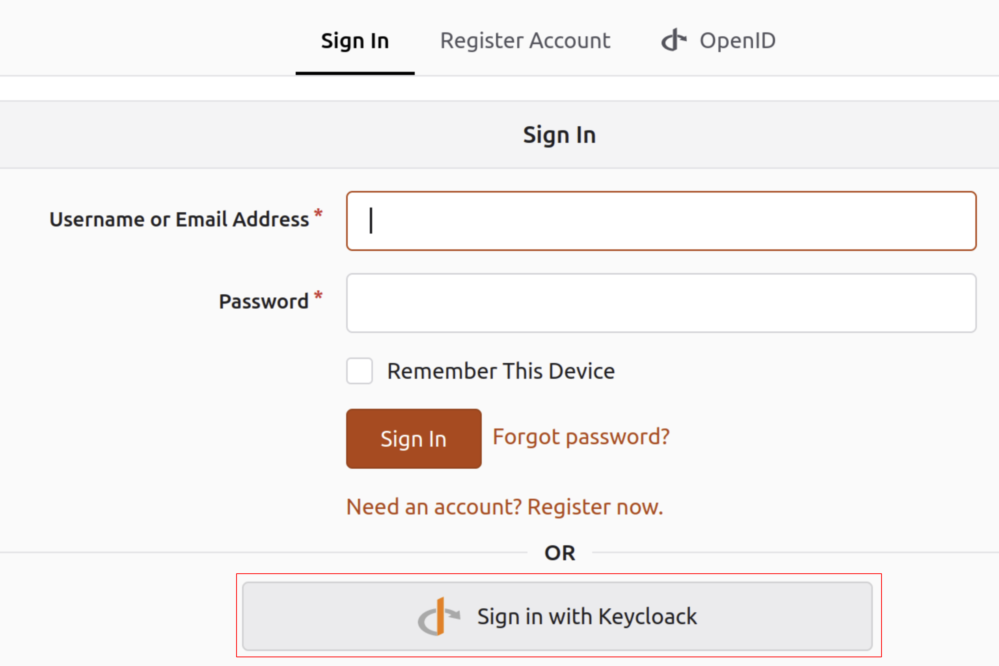

# Template Repository

## Introduction

This repository was initially started as part of the hackathon 2024 part of the symposium.

## Contributors

* @Gallypette
* @Chrisr3d
* @DavidCruciani

## Instructions

# Authentication in Forgejo using Keycloak

After the installation of keycloak and forgejo

## Part 1

### Keycloak

- Create a Realm

- Create a Client
  
  - Use "forgejo" as "Client ID"
  - Tap Next
  - Check "Client authentication"
  - Tap Next
  - Enter http://YOUR-FORGEJO-IP:YOUR-FORGEJO-PORT/* for "Valid redirect URIs"
  - Enter http://YOUR-FORGEJO-IP:YOUR-FORGEJO-PORT/ for "Web origins"
  - Tap Save

- Now go in credentials tab and save the client secret
  
  - Remark: this tab does not appears if the "Client authentication" is no set in the previous step.

    

- Create a user

- Add a new password by going in credentials tab after the user creation
  
  - Set password
  - Put temporary as off

## Part 2

### Forgejo

- Connect as admin user

- Click on the right top corner on your profile pic, go in site administration

  

- Under "Identity and Access" go in "Authentication sources"

- Click on "Add Authentification Source"
  
  - Select "OAuth2" in "Authentication type"
  - Enter "Keycloak" in "Authentication name"
  - Select "OpenID Connect" in "OAuth2 Provider"
  - In "Client ID" tap "forgejo". This need to be the same name as the "Client ID" in keycloack
  - In "Client Secret" enter the client secret you save earlier 
  - In "OpenID Connect Auto Discovery URL" enter http://YOUR-KEYCLOAK-IP:YOUR-KEYCLOAK-PORT/realms/YOUR-REALM-NAME/.well-known/openid-configuration
  - Now save your configuration
admin_view
 

## Part 3

### Forgejo

- Always on site administration under "Identity and Access" go in "User accounts"
- Create a new user

## Part 4

Sign out from forgejo and sign in with Keycloak

 

You, normally, arrived on a keycloack webpage with a form to login

Enter credentials for the user you want to authenticate on keycloak

Now you are redirect on forgejo with credentials again. Click on "Link to Existing account". Here you'll link the keycloak account to the forgejo account

Enter credentials for the user you want to authenticate on forgejo

You might be asked to update your password.

And That's it, You have finished.

## Authorization

We did not success in having authorization to work with keycloak. The crux of the issue is that neither `forgejo` nor `gitea` support nested structures for roles.
See the following issues:
https://github.com/go-gitea/gitea/issues/10016
https://codeberg.org/forgejo/forgejo/issues/1756

The answer lies in mapping roles to a flat token claim.
