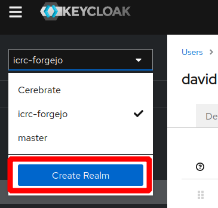
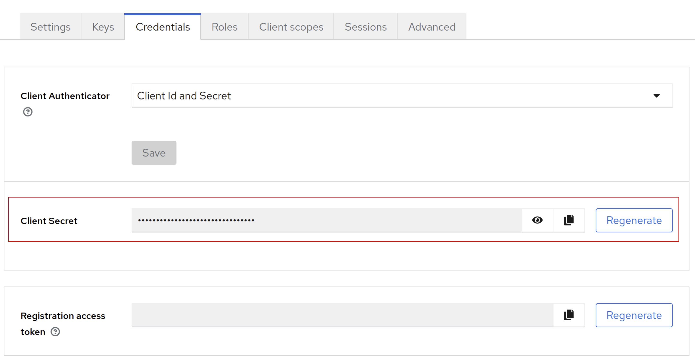
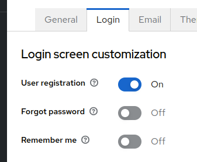

# Authentication in Forgejo using Keycloak

[](https://opensource.org/license/bsd-3-clause/)

[](https://github.com/digitharium/hiami-forgejo-keycloak/actions/workflows/main.yml)

## Introduction

This repository was initially started as part of the hackathon 2024 part of the symposium to create integration between Keycloak and Forgejo.

## Contributors

* @Gallypette
* @Chrisr3d
* @DavidCruciani
* @SDKAAA

## Maintainers

* @SDKAAA

## Instructions

First Install Keycloak and Forgejo by changing directory to folders keycloak and Forgejo and run the following command in each

```docker compose up```

In case you don't have docker engine installed install it as per the instructions here: https://docs.docker.com/engine/install/fedora/#install-using-the-repository

And then start docker with:
```sudo systemctl start docker```

## Automatic Configuration

### Keycloak
- Initiate keycloak by running the script under the keycloak folder and running this command:

  ```./post_compose_kc.sh```
  
  *This will create the realm and client in keycloak*
  *Remark: in case you change the default values make sure to update the .env files under cli_init*

### [WIP] Forgejo
- Forgejo Automatic config still under construction, please skip to the manual config

## Manual Configuration

### Part 1: Keycloak Configuration

- Create a Realm



*If you intend to have multiple applications integrated with Keycloak, using the same realm for multiple applications/clients will enable the users to SSO seamlessly without the need for re-login. Otherwise you can create 1 realm per application/client.*

- Create a Client
  
  - Use "OpenID Connect" as "Client Type"
  - Use "forgejo" as "Client ID"
  - Tap Next
  - Make sure "Client authentication" is set to "On"
  - Tap Next
  - Enter http://YOUR-FORGEJO-IP:YOUR-FORGEJO-PORT/* for "Valid redirect URIs"
  - Enter http://YOUR-FORGEJO-IP:YOUR-FORGEJO-PORT/ for "Web origins"
  - Tap Save

- Now go in credentials tab and save the client secret

  
  
  *Remark: this tab does not appears if the "Client authentication" is not set in the previous step.*


### Part 2: Forgejo Configuration

- Navigate in the browser to the Forgejo site at http://localhost:30002 and add a username, password and email for the admin user and lunch the setup.

- Connect as admin user (usually after setup, the admin user is automatically connected)

- In Forgejo, Click on the right top corner on your profile pic, go in site administration

  

- Under "Identity and Access" go in "Authentication sources"

- Click on "Add Authentification Source"
  
  - Select "OAuth2" in "Authentication type"
  - Enter "Keycloak" in "Authentication name"
  - Select "OpenID Connect" in "OAuth2 Provider"
  - In "Client ID" tap "forgejo". This need to be the same name as the "Client ID" in keycloack
  - In "Client Secret" enter the client secret you saved earlier 
  - In "OpenID Connect Auto Discovery URL" enter http://YOUR-KEYCLOAK-IP:YOUR-KEYCLOAK-PORT/realms/YOUR-REALM-NAME/.well-known/openid-configuration
  - Required claim name: user_type
  - Required claim value: forgejo_user
  - Now save your configuration
admin_view
 

### That's it!
New users created in the keycloak realm will be able to login to forgejo by clicking on login using keycloak
You can also enable the creation of new users from keycloak which will automatically be able to sign in to forgejo:




## Authorization

The below steps explain how to provide basic authorization where access to Forgejo is controlled by whether a user is member of a Keycloak group or not.

This method will use a specific "Required Claim Name" and "Required Claim Value" in Forgejo while sending this info from Keycloak using the client scope mappers.

Hereafter KC refers to Keycloak and FJ to Forgejo.

* in KC create a group called forgejogroup
* in FJ create 2 users (user1 and user2 obviousbly create them throught he SSO to KC)
* add user user1 to forgejogroup (do NOT add user2 to the group; the purpose of user2 is to test if the authorization works for user and not for user2)
* in KC, edit the group and create the attribute with the following:
  * Key: user_type
  * Value: forgejo_user
* in FJ, in admin settings/Identity&Access/Authentication sources, edit the Keycloak source and enter the below values in the below fields:
  * Required claim name: user_type
  * Required claim value: forgejo_user
* Update the authentication source.
* in KC, under Client Scopes, create a new client scope called forgejoclientscope
* under this KC client scope, add a mapper with the following info:
  * Mapper Type: "Group Membership"
  * Name: forgejogroup
  * Token Claim Name: forgejogrouptoken
* under this KC client scope, add a second mapper with the following info:
  * Mapper Type: "User Attribute"
  * Name: user_type
  * User Attribute: user_type
  * Token Claim Name: user_type
* in KC, edit the client and add the above selected client to the scopes of the client

That's it!
<br>user1 can now sign in and get access to FJ while user2 can sign in but will receive an error.

.

*Full Authorization still needs to be investigated:*

We did not success in having authorization to work with keycloak. The crux of the issue is that neither `forgejo` nor `gitea` support nested structures for roles.
See the following issues:
https://github.com/go-gitea/gitea/issues/10016
https://codeberg.org/forgejo/forgejo/issues/1756

The answer lies in mapping roles to a flat token claim.
